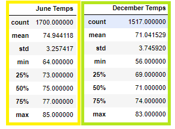

# surfs_up

## Overview of Project
SQLAlchemy was used to connect to data stored in a SQLite file. The file contains weather data for Oahu. The project is to help a Surf and Shaved Ice Shop determine if the shop can expect a significant drop in business during the off season due to weather concerns. As part of the project, Flask was used to display weather data as API on a local host server

The challenge required temperature data to be queried for the months of June and December. Each data set was saved into a dataframe using Pandas and descriptive statistics were generated for each data set. Analysis on the data is given below with recommendations for further analysis. 

### Purpose
The purpose of the challenge was to compare weather statistics (mainly temperature) for the month of June to those for the month of December to determine whether the seasons could affect the surf and ice cream shop business.

## Method
Using Python, Pandas functions and methods, and SQLAlchemy, the date column of the Measurements table in the hawaii.sqlite database was filtered to retrieve all the temperatures for the month of June. Those temperatures was then converted to a list, create a DataFrame from the list, and generate the summary statistics.

## The key differences in weather between June and December
>
>1. The average temperature for June is 74.9 degrees, while the average is 71.0 degrees in December. With an average difference of no more than 4°F -, the temperature during the months of June and December do not differ by much.
>
>2. The standard deviation of these two months also does show that there is more variation in temperatures in December (3.75°F) as opposed to June (3.26°F). The range from min to max for June is 64 to 85 degrees, while for December, the range is 56 to 83 degrees. This yield a difference of 2°F - max temperature and 8°F - min temperature.
>
>3. While the temperatures are not as ideal in December as in June, it appears that both months may be good to conduct business during. However, if you had to choose one month over the other, June is the month to go with.
>
>**Image 1: Showing the summary statistics for June and December temperatures DataFrame:**
>

## Summary of Results
>The mean temperature for June and December is 75 and 71 degrees Fahrenheit respectively. There is not much of a temperature difference between the two months which is ideal for business. For further analysis I would recommend grouping by station and comparing precipitation and temperature statistics across each station. I would also recommend comparing other months of the season such as January and July.

### Additional queries to perform to gather more weather data for June and December?
>- A query to get the precipitation Data for the month of June and December.
>- A query to group Tobs data by Station for the month of June and December.
> - Lastly, instead of looking at just June and December individually, it would be better to see if the other 10 months have similar statistics. It would be best to plot the temperatures as line plots, to compare them over the course of the year. If all of the other months are between the statistical ranges of June and December, it may be feasible to keep the business open year round. Looking at 2 out of the 12 months is not enough to support a good valuation